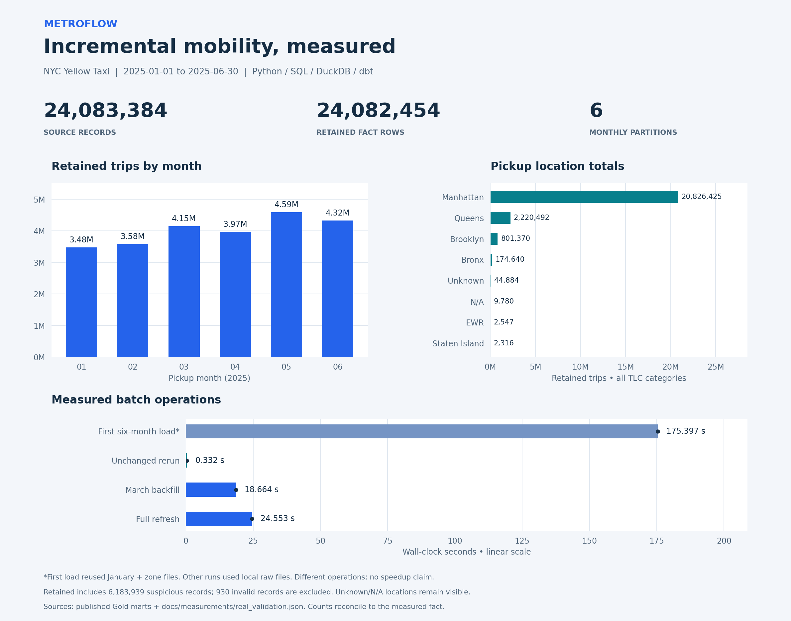
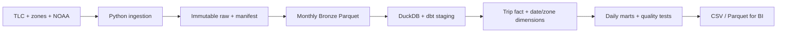
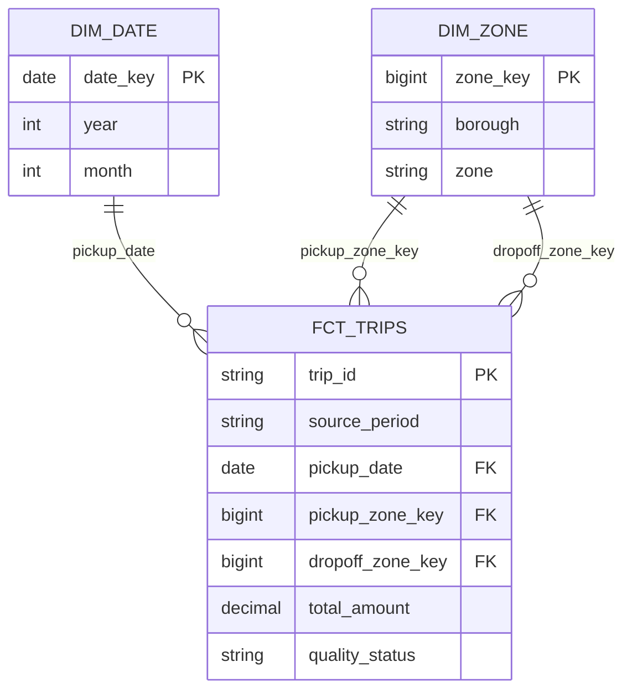
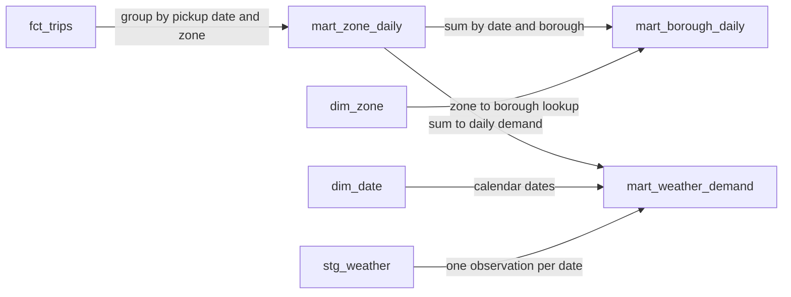

# MetroFlow
### Incremental Mobility Data Platform

An incremental Python/SQL batch pipeline for real NYC Yellow Taxi records, official taxi zones and NOAA daily weather. It turns recurring monthly files into tested dimensional models and Power BI-ready reporting datasets.

[](https://github.com/jeffreylin0217/metroflow-de/actions/workflows/ci.yml)



The snapshot is generated from one published Gold reporting generation and recorded benchmark runs. Retained trips include suspicious records. The first timed load reused January and the zone lookup; the other operations used cached raw files. [Exact plotted values and source checksums](docs/assets/snapshot_values.json) · [Visual methodology and reconciliation](docs/VISUALS.md).

## Architecture



**Measured scale: 24,083,384 source trips → 24,082,454 retained fact rows.**

**Scope:** January–June 2025, six real monthly files. Exact measured scale and runtime are recorded in [the audit](docs/AUDIT.md) and [machine-readable evidence](docs/measurements/real_validation.json).

**Stack:** Python 3.12, PyArrow, Parquet, DuckDB, dbt-duckdb, SQL, SQLite source metadata, pytest and GitHub Actions.

## Engineering features

- Immutable source versions with URLs, SHA-256 hashes, row counts and schema fingerprints.
- Required-column/type contracts and safe canonical casts; optional TLC schema differences tolerated.
- Monthly ingestion and fact replacement; unchanged runs skip warehouse work.
- Explicit backfills, remote-correction checks and full-refresh equivalence verification.
- Documented row grains, unique dimensions, safe daily weather joins and reconciliation tests.
- Quality classifications with retained suspicious rows and auditable exclusions.
- Candidate warehouse validation before publication, one-writer lock and structured run logs.

## Data model

The fact has three many-to-one dimension relationships. These are logical keys validated by dbt; the diagram does not imply database-enforced foreign-key constraints.



The daily marts are aggregations, with their SQL lineage shown separately. Weather joins after daily aggregation; it is never attached to every trip.



| Model | One row represents |
|---|---|
| fct_trips | One retained TLC source record |
| dim_zone | One official TLC location key |
| dim_date | One calendar date |
| mart_zone_daily | Date × pickup zone |
| mart_borough_daily | Date × pickup borough |
| mart_weather_demand | One Central Park observation date |
| mart_quality | Source month × quality status |

[Architecture and recovery](docs/ARCHITECTURE.md) · [Quality policy](docs/QUALITY.md) · [Official sources](docs/SOURCES.md)

## Run locally

Use Python 3.12 on macOS/Linux (WSL for Windows). Reserve several GB for raw, Bronze, warehouse and temporary candidate files. Run commands from the repository root.

```bash
python3.12 -m venv .venv
source .venv/bin/activate
pip install -r requirements.lock
python -m metroflow.pipeline --start 2025-01 --end 2025-06
```

The first run downloads official public files; no credentials are required. Source availability and download time depend on the publishers. A missing month fails explicitly, leaving previous reporting available.

```bash
# Unchanged rerun: verify local hashes and skip completed work
python -m metroflow.pipeline --start 2025-01 --end 2025-06 --offline
# Rebuild an existing month from immutable local bytes
python -m metroflow.pipeline --start 2025-03 --end 2025-03 --force-month 2025-03
# Explicitly check the publishers for corrected source bytes
python -m metroflow.pipeline --start 2025-01 --end 2025-06 --check-remote
# Rebuild ALL loaded history, including months outside the requested slice
python -m metroflow.pipeline --start 2025-01 --end 2025-06 --full-refresh --offline
```

`data/manifest.sqlite` audits source versions. `data/state.json` records successful publication. `data/runs/` holds run metadata. `data/warehouse.duckdb` contains the warehouse; `data/reporting` points to the current tested reporting generation. Large data and generated dbt artifacts are gitignored.

## Tests and dbt exploration

```bash
python -m pytest -q
python -m compileall -q metroflow tests scripts
python -c "import metroflow.pipeline, metroflow.ingest, metroflow.bronze"
git diff --check

# After an initialized pipeline; use the CLI for scheduled mutations
export METROFLOW_DB="$PWD/data/warehouse.duckdb"
dbt test --project-dir dbt --profiles-dir dbt
dbt docs generate --project-dir dbt --profiles-dir dbt
# Measure real rerun, March backfill and full-refresh equivalence
PYTHONPATH=. python scripts/verify_real.py
```

pytest builds realistic small synthetic source files and invokes actual dbt build/test. CI runs that lifecycle offline: no millions of rows, API tokens or external dataset downloads. The real-data validation is separate; consult the audit for results.

## Real versus derived

TLC provides timestamps, locations, passenger counts, distances, fares, tips and payment codes. NOAA provides daily precipitation, snowfall and temperatures. MetroFlow derives source-row IDs, trip duration, quality flags, date attributes and daily aggregates. The ID is **not** a TLC-issued trip identifier. Negative corrections and other suspicious values are retained and explained. Weather correlations are observational, not causal.

[Power BI import guide](docs/POWER_BI.md)

## Regenerate the project snapshot

After a successful six-month pipeline run, install the optional plotting dependency and render the image:

```bash
source .venv/bin/activate
pip install -r requirements-visuals.txt
python scripts/generate_readme_visuals.py
```

The generator reads a single resolved `data/reporting` generation, validates its grains, reconciles all location and monthly counts, and checks them against the measured fact totals before plotting. It writes a PNG and a small JSON record of exact values and source checksums to `docs/assets/`. The committed image is viewable without running the pipeline; raw data remains excluded from Git. These charts are a reporting sample, not a completed Power BI dashboard.

If the loaded date range or counts change, regenerate the benchmark evidence for that range before refreshing the snapshot; a mismatch fails explicitly. Recorded benchmark dates remain in the evidence files independently of Git commit dates.

## Status and scope

v1 implements local batch ingestion, dbt transformations, quality controls, reproducible fixtures, reporting exports and measured real-data validation.
