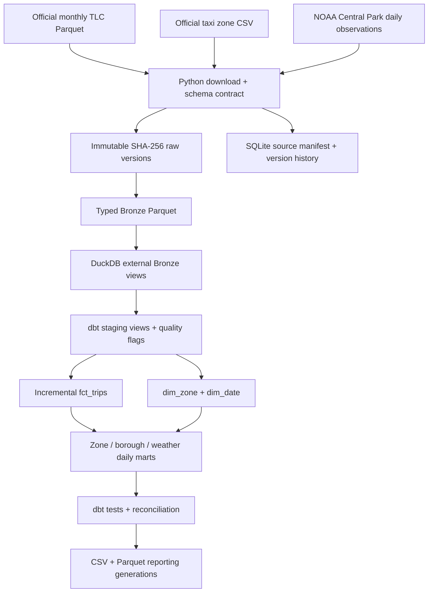

# Architecture and operational boundaries

Python owns downloads, checksums, contracts, control flow and exports. Arrow streams source batches into one canonical Parquet file per source month. Python performs no business aggregation. SQLite is a local metadata ledger, not a second warehouse. DuckDB runs dbt SQL over Parquet. dbt owns staging, quality classifications, facts, dimensions and marts.

## Incremental boundary

A source SHA + Bronze SHA + implementation fingerprint determines work. Unchanged months skip downloads and Bronze writes. With no changes, dbt and exports are skipped as well. Adding a month reads just that new month into Bronze and the fact; small downstream marts are rebuilt across the retained fact. Quality reports and some tests scan all loaded rows, so not every downstream step is partition-incremental.

The fact's transactional pre-hook deletes requested source-month partitions, then appends their current non-invalid rows. Empty rebuilt partitions work correctly. Each source record is identified by `source_sha256:source_row`, with zero-based Parquet physical row order preserved through Arrow batches. A corrected file creates new source identities. Repeated-looking rides are not automatically collapsed because TLC provides no reliable ride identifier. Source-byte duplicates across periods are rejected by the ledger.

`--force-month` rebuilds local Bronze and the fact partition without redownloading. `--check-remote` downloads candidates to find upstream corrections; old hash-named raw files remain immutable. `--full-refresh` rebuilds all previously loaded months plus requested months from raw and creates a fresh warehouse. It does not prune old loaded months. Changes to Python/dbt/contracts/requirements conservatively rebuild everything. There is no migration framework.

## Failure recovery and publishing

A POSIX advisory lock permits one writer per data directory (macOS/Linux; use WSL on Windows). Downloads use `.partial` files and bounded HTTP retries. Schema validation precedes raw TLC registration. Bronze files are written to temporary files and atomically replaced. Every normal skip checks raw and Bronze integrity; corrupt raw fails instead of silently overwriting evidence.

A candidate database (same database basename as the published warehouse) is copied from the last successful database for incremental work. dbt runs and tests against it. Exports are generated in a new reporting generation. Only successful validation allows publishing by file replacement; the reporting symlink is then atomically moved, and the successful state is written last. Failure before publication leaves published fact tables and reporting untouched. Retry compares against the last committed state and reprocesses pending changes.

This is not a distributed transaction across files. A crash between database, symlink and state publication can expose different generations temporarily; rerunning converges. Power BI should read one resolved `data/reports/<run_id>/` generation for a consistent snapshot, not repeatedly resolve a changing symlink during refresh. Bronze-backed staging views reflect the current Bronze files, so the published database is not a snapshot of staging during a failed rebuild. Published facts/marts and reporting files are snapshots. Old reporting generations are retained for inspection; delete obsolete generations manually when no consumer uses them.

External dbt commands are useful for exploration, but scheduling must call the CLI to preserve locking and publication. Do not run a standalone dbt mutation concurrently with the pipeline.

## Scheduling decision

Scheduling is outside the current repository scope. The Python CLI handles ingestion, Bronze processing, dbt transformations, validation and reporting, and can be invoked by an external scheduler.
